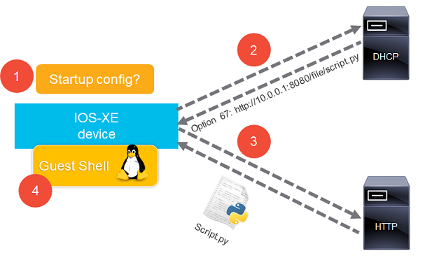

# Zero Touch Provisioning

Cisco has introduced [ZTP](https://www.cisco.com/c/en/us/td/docs/ios-xml/ios/prog/configuration/169/b_169_programmability_cg/zero_touch_provisioning.html) on IOS-XE 16.5.1 onwards to give a device the capability to download and run a Python script in a Linux Guest Shell to perform software upgrade and configuration tasks on the device.



## Overview

The Python script has the following functionality built-in:
- Downloads and installs IOS-XE software from a given URL, if needed
- Changes Boot Mode to installed, if device is in bundled boot mode
- Performs stack renumbering, based on a specified list of serial numbers and switch numbers
- Sets switch priorities, highest priority on the top switch
- Handles stack version mismatches using ‘auto upgrade’
- Turns on the blue beacons of a switch stack in case serial numbers are missing or are extra
- Uses an external dictionary by downloading a specified JSON text file (refer to GUI App for details)
- Can also use an internal dictionary for data storage, such as serial numbers and configuration templates
- Applies a configuration template, using $-based placeholders for variable substitutions
- Can also download an external template file from a given URL
- Executes commands upon script completion, such as for Smart Licensing registration
- Can save the device configuration, if the workflow has completed successfully
- Sends logging to a specified syslog server for script monitoring

## Using

`script.py` needs 3 variables to be filled in by the user:
- SYSLOG is an IP address string of the syslog server, an empty string disables syslog
- JSON is a string with URL of the JSON encoded DATA object as specified below. Empty string disables downloading of external device data.
- DATA is a list of dicts that defines device data. Empty list disables the internal data of the script. To specify device defaults, omit the key named `stack` from one dict. Valid keys and values are:

  Key | Value
  --- | ---
  `stack` | dict with target switch number as key and serial number as value
  `version` | string with target version used to determine if upgrade is needed
  `base_url` | string with base URL to optionally join with install/config URL
  `install` | string with URL of target IOS to download
  `config` | string with URL of configuration template to download
  `subst` | dict with keys that match the placeholders in the template
  `cli` | string of finishing commands separated by space and semicolon
  `save` | boolean to indicate to save configuration at script completion
  `template` | string holding configuration template with $-based placeholders

Default settings are inherited by all stacks, but stack settings have preference. For example: if the default version is 16.6.5 and the stack version is 16.9.2, then the latter is used. When the variable DATA is filled, the script, IOS-XE images and configurations can be served by any HTTP server. Example configuration of `script.py`:

```python
SYSLOG = '10.0.0.1'
JSON = ''
DATA = [{
        'version': '16.6.5',
        'install': 'http://10.0.0.1/cat9k_iosxe.16.06.05.SPA.bin',
        'save': True,
        'template': '''hostname $name
            ip domain name lab
            ip name-server 8.8.8.8
            interface range $uplink1 , $uplink2
             description uplink'''
    }, {
        'stack': {'FCW3498U0EL': 1, 'FCW348U9FUI': 2, 'FOC3490ERIJ': 3},
        'subst': {'name': 'switch1', 'uplink1': 'Gi1/0/1', 'uplink2': 'Gi2/0/1'}
    }, {
        'stack': {'FCW34897QWE': 1},
        'subst': {'name': 'switch2', 'uplink1': 'Gi1/0/1', 'uplink2': 'Gi1/0/2'},
        'version': '16.9.2',
        'install': 'http://10.0.0.1/cat9k_iosxe.16.09.02.SPA.bin',
        'cli': 'license smart register idtoken ****'
    }
]
```

Instead of entering the data directly into `script.py`, the GUI app can be used to enter the data and serve the files. The same key names of the list of dicts that defines device data, are displayed in the GUI app. Example configuration of `script.py`:

```python
SYSLOG = '10.0.0.1'
JSON = 'http://10.0.0.1:8080/data'
DATA = []
```

## GUI App

The GUI App consists of two components:
- An API server backend `app.py` based on [Bottle](http://bottlepy.org/) (a micro web framework for Python) and [Waitress](http://waitress.readthedocs.io/) a production-quality pure-Python WSGI server
- An AJAX web frontend written in pure JavaScript (`index.html`, `main.js` and `style.css`)


The API calls or routes provided by `app.py` are:

Call | Description
--- | ---
`GET /file/<name>` | used to serve files and subdirectories, such as IOS-XE images or configurations
`DELETE /file/<name>` | the request removes the specified file from disk
`POST /file` | used by the AJAX client form to upload a file to the server 
`GET /list` | the server sends a JSON text list of all files in the script directory and subdirectories 
`GET /data` | upon receiving the request, the server sends the dataset as JSON text to the client/switch
`POST /data` | the client sends the dataset as JSON text to the server using the HTML POST method
`GET /csv` | upon receiving the request, the server flattens the dataset and exports it as a CSV file
`POST /csv` | the client sends the CSV file with the flattened dataset to the server for importing

`App.py` validates the format of the data received by the `POST` APIs before writing it to `data.json` file and when the data is read from file for the `GET /data` and `GET /csv` API call. HTTP status code 500 is returned in case of invalid or missing data. Files are served from the current working directory.


## Installation

Configure a DHCP server to serve a range with option 67 set to: `http://x.x.x.x:8080/file/script.py`, where x.x.x.x is the IP address of the machine hosting `app.py`. Sample configuration on a Cisco device:
```
ip dhcp excluded-address 10.0.0.1
ip dhcp pool ztp_pool
 network 10.0.0.0 255.255.255.0
 default-router 10.0.0.1
 option 67 ascii http://10.0.0.1:8080/file/script.py
```

Install Bottle and Waitress using [PIP](https://pypi.org/project/pip/) or on Ubuntu as follows:

`sudo apt-get install python-bottle python-waitress`

Put `app.py`, `index.html`, `main.js`, `style.css` and `script.py` in a directory and start the server backend on Linux as follows:

`nohup python app.py &`

The app can be run on Windows as well. Python 2.7 and 3 are supported.

## Testing

The script has been successfully tested on the following platforms:
- Cisco Catalyst 9300 Series Switches
- Cisco Catalyst 9400 Series Switches