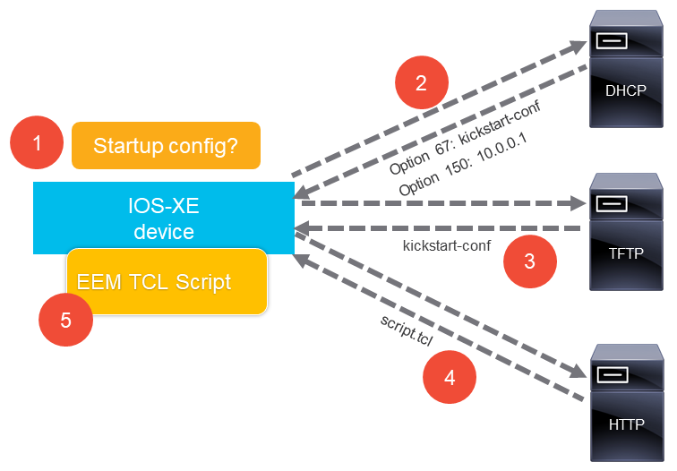

# Zero Touch Provisioning using AutoInstall

This alternative implementation can be used if your device does not support the [ZTP](https://www.cisco.com/c/en/us/td/docs/ios-xml/ios/prog/configuration/169/b_169_programmability_cg/zero_touch_provisioning.html) feature. It uses an [EEM Script](https://www.cisco.com/c/en/us/td/docs/ios-xml/ios/eem/configuration/15-mt/eem-15-mt-book/eem-policy-tcl.html) to perform software upgrade and configuration tasks on the device. The [AutoInstall Using DHCP for LAN Interfaces](https://www.cisco.com/c/en/us/td/docs/ios-xml/ios/fundamentals/configuration/15mt/fundamentals-15-mt-book/cf-autoinstall.html) feature is used to download an initial configuration to the device containing a kickstart EEM applet. The kickstart applet is triggered automatically and downloads, registers and runs the EEM script.



First step is to check if whether there is a startup config present, if not, then the second step is to perform a DHCP request. The third step is to download the configuration specified in the DHCP reply. The forth step performed by the EEM applet is to download the EEM script. The fifth and final step is to execute the EEM script.

## Overview

TCL 8.3.4 which does not support dictionaries is bundled with IOS. The HTTP client package is available to an EEM script, but JSON is not. *script.tcl* does a minimalistic JSON implementation and it uses associative arrays and lists to handle data.

*script.tcl* has the following functionality built-in:
- Downloads and installs IOS XE software from a given URL, if needed
- Changes Boot Mode to installed, if device is in bundled boot mode
- Performs stack renumbering, based on a specified list of serial numbers and switch numbers
- Sets switch priorities, highest priority on the top switch
- Handles stack version mismatches using *auto upgrade*
- Turns on the blue beacons of a switch in case serial numbers are missing or are extra
- Downloads instruction data (such as serial numbers and configuration templates) in JSON formatted text
- Can also use instruction data embedded in the script
- Applies a configuration template, optionally using $-based placeholders for variable substitution
- Can also download an external template file from a given URL
- Executes commands upon script completion, such as for Smart Licensing registration
- Sends script and command output as JSON text to a URL (refer to GUI App for details)
- Can save the device configuration, if the workflow has completed successfully
- Sends logging to a specified syslog server for script monitoring

## Using

*script.tcl* needs 4 variables to be filled in by the user:
- SYSLOG is an IP address string of the syslog server
- LOGAPI is a string with URL to log API
- JSON is a string with URL of the JSON encoded DATA object as specified below.
- DATA is a list of lists of key value pairs to define device data. To specify device defaults, omit 'stack' from one list. Empty list disables the internal data of the script. Valid keys and values are:

  Key | Value
  --- | ---
  *stack* | list with target switch number and serial number as pairs
  *version* | string with target version used to determine if upgrade is needed
  *base_url* | string with base URL to optionally join with install/config URL
  *install* | string with URL of target IOS to download
  *config* | string with URL of configuration template to download
  *subst* | list with key value pairs that match the placeholders
  *cli* | string of final IOS commands, or TCL if within {{...}}
  *save* | boolean to indicate to save configuration at script completion
  *template* | string holding configuration template with $-based placeholders

Default settings are inherited by all stacks, but stack settings have preference. For example: if the default version is 16.6.5 and the stack version is 16.9.2, then the latter is used. When the variable DATA is filled, the script, IOS XE images and configurations can be served by any HTTP server. Example configuration of *script.tcl*:

```tcl
set SYSLOG "10.0.0.1"
set DATA [list \
[list base_url "http://10.0.0.1:8080/" \
	version "16.6.5" \
	cli "show inventory" \
	install "./cat9k_iosxe.16.06.05.SPA.bin" \
	save 1 \
	template {hostname ${name}s
			ip domain name $$lab
			ip name-server 8.8.8.8
			interface range $uplink1 , $uplink2
			 description uplink}] \
[list stack [list 1 "FCW0000D0LR" 2 "FCW0000G0L7" 3 "FOC0000X0DW"] \
	"subst" [list name "switch1" \
	uplink1 "Gi1/0/1" \
	uplink2 "Gi2/0/1"]]]
```

Instead of entering the data directly into *script.tcl*, the GUI app can be used to enter the data and serve the files. The same key names of the list of lists that defines device data, are displayed in the GUI app. Example configuration of *script.tcl*:

```tcl
set SYSLOG "10.0.0.1"
set LOGAPI "http://10.0.0.1:8080/log"
set JSON "http://10.0.0.1:8080/data"
set DATA {}
```

Simply put, the client retrieves instruction data from the server and stores new instruction data on the server entered by the user. Then *script.tcl* retrieves that instruction data, executes it and stores the output on the server:


## Install

Configure a DHCP server to serve a range with options 67 and 150. The ZTP device will load the specified *kickstart-conf* file to running configuration on bootup. Sample configuration on a Cisco device:

```
ip dhcp excluded-address 10.0.0.1
ip dhcp pool ztp_pool
 network 10.0.0.0 255.255.255.0
 default-router 10.0.0.1
 option 150 ip 10.0.0.1
 option 67 ascii kickstart-conf
```

Configure a TFTP server to serve the *kickstart-conf* file. Customize the URL used by the copy command to your needs.

The installation of the GUI app is the same, except *script.tcl* is used instead of *script.py*.

## Testing

The script has been successfully tested on the following platforms running 16.3.x and higher software:
- Cisco Catalyst 9300 Series Switches
- Cisco Catalyst 3850 Series Switches
